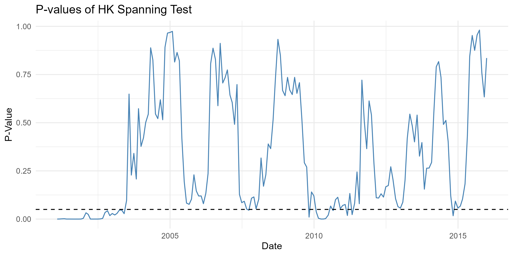
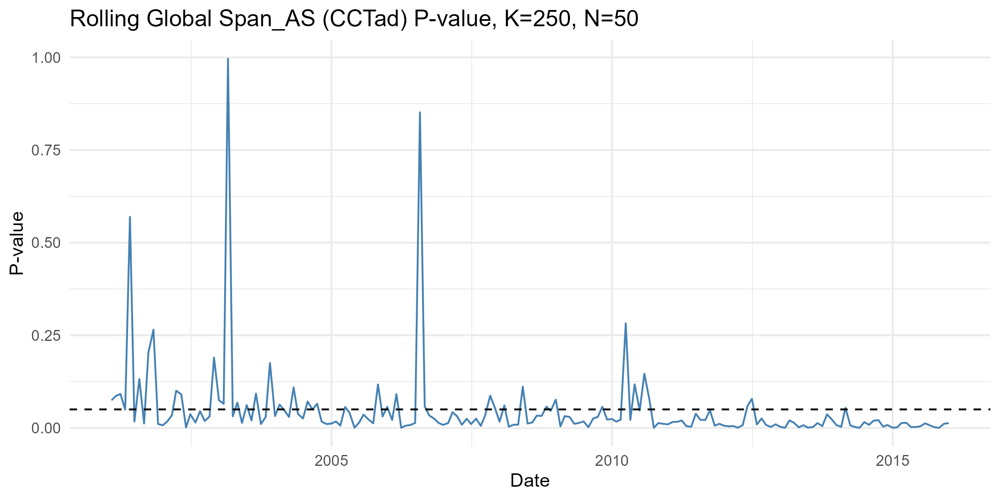
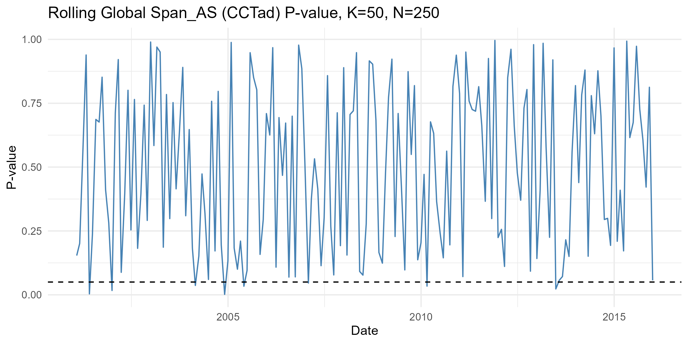

# Introduction

*Mean-variance spanning* (MVS) refers to the hypothesis that a given set
of “benchmark” assets already spans the efficient frontier achievable by
a larger set of assets. In other words, adding new assets (the “test”
assets) to an existing portfolio cannot improve the portfolio’s
risk-return trade-off if spanning holds [@HubermanKandel1987]. If the
MVS hypothesis is not rejected, the benchmark assets are mean-variance
efficient, and adding the test assets offers no ex ante diversification
benefit.

Spanning tests are economically important because they address questions
such as: Does an existing portfolio (e.g., a market index) already
capture all investment opportunities? Or can diversifying into new asset
classes or markets further reduce risk or increase returns? These tests
originate in the portfolio efficiency literature [@GRS1989] and are
closely related to tests of the Capital Asset Pricing Model (CAPM),
where one examines whether a market portfolio is efficient (spanning)
with respect to individual assets.

From a statistical perspective, mean-variance spanning can be assessed
by formulating the portfolio expansion as a set of linear restrictions
on the mean and covariance of returns. Early work by @HubermanKandel1987
(HK) formalized the spanning hypothesis and proposed a multivariate test
for it. Subsequent research developed specialized tests for different
aspects of spanning: @GRS1989 (GRS) introduced a well-known
alpha-spanning test for the efficiency of a given portfolio;
@BrittenJones1999 (BJ) studied the impact of estimation error on
efficient portfolios; and more recent studies have extended spanning
tests to high-dimensional settings (many assets) and time-varying
volatility [@GungorLuger2016].

The `spantest` package brings together these developments, implementing
a comprehensive set of mean-variance spanning tests from the literature.

# Theoretical framework

Consider a benchmark set of $K$ asset returns (e.g., an existing
portfolio or set of portfolios) and a test set of $N$ additional asset
returns. Let $r_{1,t}$ be the $K$-dimensional return vector of benchmark
assets at time $t$, and $r_{2,t}$ the $N$-dimensional return vector of
test assets. The MVS hypothesis states that the efficient frontier
spanned by $r_{1,t}$ alone is the same as that spanned by the combined
$(r_{1,t}, r_{2,t})$. This implies that the new assets $r_2$ do not
improve the minimum achievable variance for a given expected return, nor
do they allow a higher expected return for a given variance.

In practical terms, spanning can be characterized by conditions on the
means and covariances of returns. A convenient formulation is obtained
by regressing each test asset on the benchmarks. For each test asset
$j$, consider the linear model (with constant term $\alpha_j$ and slope
vector $\beta_j$):

$$
r_{2,j,t} = \alpha_j + \beta_j^\top r_{1,t} + \varepsilon_{j,t},
$$

where $\mathbb{E}[\varepsilon_{j,t}] = 0$.

If a risk-free asset is available (or returns are measured in excess of
the risk-free rate), mean-variance spanning is equivalent to all
intercepts being zero, $\alpha_j = 0$ for each test asset
[@PesaranYamagata2023].

This hypothesis is formulated as:

$$
H_0^\alpha: \alpha = 0,
$$

and is called the *maximum Sharpe ratio spanning test*.

Intuitively, $\alpha_j = 0$ means the new asset $j$ offers no higher
expected return than what can be replicated by a combination of the
benchmark assets (no abnormal performance).

In the absence of a risk-free asset, full spanning requires that the
inclusion of new assets does not improve the *global minimum-variance*
(GMV) frontier. Let $\delta$ denote the vector of optimal portfolio
weights assigned to the test assets in the GMV portfolio formed from
both benchmark and test assets. The corresponding null hypothesis is:

$$
H_0^\delta : \delta = 0,
$$

which implies that the test assets receive zero weight in the GMV
portfolio and thus provide no variance reduction. This is known as the
*global minimum-variance spanning test* [@KanZhou2012].

Finally, @KanZhou2012 show that the *full MVS* hypothesis can be stated
as a joint null:

$$
H_0^{\alpha,\delta}: \alpha = 0, \quad \delta = 0,
$$

where $\alpha$ is the $N\times1$ vector of intercepts and $\delta$
represents $N$ additional constraints ensuring no variance improvement.

Under $H_0^{\alpha, \delta}$, for every test asset (or any portfolio of
them) one can find a portfolio of the $K$ benchmarks that replicates its
performance. If either the intercept conditions or the variance
conditions fail, the new assets expand the frontier and spanning is
violated.

These hypotheses lead to different types of statistical tests. **Maximum
Sharpe ratio spanning tests** focus on the $\alpha_j = 0$ restrictions
(no excess returns beyond the span of benchmarks). **Global
minimum-variance spanning tests** focus on the $\delta = 0$ restrictions
(no reduction in minimum variance). **MVS tests** assess the full set of
constraints simultaneously.

In all cases, the tests typically involve comparing estimated portfolio
moments (means, variances) with and without the new assets, taking into
account estimation uncertainty. Early multivariate test procedures for
spanning were derived in @HubermanKandel1987, who essentially set up the
problem as a system of linear equations (restrictions (3a) and (3b) in
their notation) and used likelihood-ratio statistics. Modern approaches,
while mathematically equivalent in form (often leading to $F$-statistics
or $\chi^2$-statistics under $H_0$), differ in how they handle finite
sample issues, large-dimensional cases, or general distributional
assumptions (e.g., non-normal returns).

## Maximum Sharpe Ratio Spanning Test (Mean Efficiency)

Maximum Sharpe ratio spanning tests examine whether adding assets yields
any improvement in expected returns for a given level of risk. They test
the null hypothesis that all $\alpha_j = 0$, i.e., the benchmark assets
already achieve the highest possible Sharpe ratio. A seminal test in
this category is the GRS test, which assesses the mean-variance
efficiency of a given portfolio.

In the GRS test, one takes a candidate efficient portfolio (e.g., the
market index) as the single benchmark and regresses each test asset’s
excess return on that benchmark. Under $H_0^\alpha$ (portfolio is
efficient), all intercepts are zero. The GRS statistic has an
$F$-distribution under $H_0^\alpha$ and combines the $N$ individual
intercept tests into one omnibus test. The `spantest` package implements
this test with the `span_grs()` function.

A limitation of the GRS test is that it assumes a moderate number of
assets and i.i.d. normally distributed returns. For large cross-sections
of assets, the test can suffer from size distortions or low power.
@PesaranYamagata2023 address this by proposing two asymptotic $Z$-tests
for alpha spanning in panels with $N$ large relative to $T$. Their first
test (sometimes denoted $J_1$) is asymptotically standard normal as
$N \to \infty$ (with $T$ fixed) under Gaussian errors. Even when the
normality assumption is relaxed, a modified test $J_2$ can be
constructed that remains asymptotically normal under certain conditions
on cross-sectional dependence.

These PY tests allow one to test spanning in high dimensions (for
example, testing if the market index spans thousands of stocks) with
controlled type I error. In practice, the `spantest` implementation
`span_py()` computes the $J$-statistics for large-$N$ alpha spanning
tests.

It is worth noting that if the benchmark set contains multiple assets
(with no risk-free asset), alpha spanning alone is not sufficient for
full spanning. Nonetheless, one can still test the $\alpha = 0$ portion
separately. @KanZhou2012 term this the mean spanning hypothesis (F1) and
derive a corresponding test statistic. In the `spantest` package, the
function `span_f1()` provides a test for the intercept restrictions only
(analogous to a multivariate $t$- or $F$-test on all $\alpha_j$). This
can be useful to isolate whether lack of spanning is coming from mean
differences.

@GungorLuger2016 (GL) propose a multivariate test for mean-variance
efficiency and spanning that accommodates large cross-sections of assets
and time-varying covariance structures. Their approach extends classical
tests by incorporating dynamic estimation of covariances and allowing
for high-dimensional settings where the number of assets may be large
relative to the sample size. This is particularly relevant for testing
the maximum Sharpe ratio hypothesis, as it directly assesses whether the
benchmark portfolio’s intercept vector ($\alpha$) is zero across
multiple assets simultaneously, accounting for time-varying risk. The
`spantest` package implements this test via the `span_gl_a()` function,
enabling practitioners to detect mean spanning violations in complex,
realistic market conditions where classical methods may lack power or
suffer from size distortions.

In addition to classical tests such as GRS and PY, the recent work by
@ArdiaSessinou2025 (AS) introduces a novel high-dimensional
mean-variance spanning test based on a subseries Cauchy Combination Test
(SCT) methodology. This approach extends mean-variance spanning tests to
settings with many benchmark and test assets where traditional methods
suffer from size distortions and power loss due to growing
dimensionality and dependence in the data. The SCT aggregates p-values
from residual-based subseries regressions across assets, enabling robust
inference in the presence of serial correlation, heteroscedasticity, and
fat tails without restrictive distributional assumptions.

Their test specifically targets the joint null hypothesis that adding
new assets does not improve the maximum Sharpe ratio achievable by the
benchmark portfolio, thereby generalizing the classical maximum Sharpe
ratio spanning test to high-dimensional regimes where the number of
assets may be comparable to or exceed the sample size. Monte Carlo
simulations confirm that the SCT maintains proper size and power under
realistic market dynamics, outperforming existing tests in complex
environments. The `spantest` package includes an implementation of this
test via the `span_as()` function, providing a practical and
computationally efficient tool for researchers and practitioners
assessing portfolio efficiency in large asset universes.

## Variance Spanning Tests (Minimum-Variance Efficiency)

Variance-spanning tests focus on whether adding new assets can achieve a
lower global minimum variance. The null hypothesis is that the
covariance structure of returns is such that the GMV portfolio of the
expanded set has the same variance as the GMV portfolio of the benchmark
set. Equivalently, the weight of each test asset in the GMV portfolio is
zero under $H_0^{\delta}$. One practical way to test this is to examine
the variance reduction obtained by including the new assets.

@KempfMemmel2006 (KM) emphasize the importance of the GMV portfolio in
investment practice: in many cases the GMV portfolio yields better
out-of-sample results than the tangency (maximal Sharpe) portfolio. They
provide improved estimates for the GMV weights and variance, which can
be used to test variance spanning. Intuitively, if the sample covariance
matrix suggests that adding an asset significantly lowers the portfolio
variance, one can reject the null of variance spanning. The `spantest`
function `span_km()` implements the approach related to the KM test. It
specifically evaluates whether the estimated minimum variance is
significantly different when the test assets are included.

Another perspective comes from @BrittenJones1999, who showed that the
sampling error in estimates of efficient portfolio weights can be large.
This means that even if an expanded portfolio shows a lower variance
in-sample, one must account for estimation uncertainty before concluding
that variance spanning is violated. BJ derived the distribution of the
estimated tangency and GMV portfolio weights, facilitating more accurate
inference on spanning. In the `spantest` function `span_bj()`, this is
incorporated by adjusting for the estimation error when testing
spanning. This yields a more precise $p$-value for the null of no
variance improvement, preventing over-rejection due to noisy estimates.

As with mean-spanning, one can define a pure variance-spanning test that
ignores mean returns and only checks the covariance condition.
@KanZhou2012's formulation of their F2 test includes a separate set of
restrictions $\delta = 0$ for variance spanning. The function
`span_f2()` in the package performs a test focusing solely on variance
spanning (e.g., via a likelihood ratio or $F$-test on the
covariance-related constraints). This can diagnose whether a failure of
spanning is due to risk reduction potential even if no significant alpha
is found.

As discussed in the previous section on maximum Sharpe ratio spanning
tests, @ArdiaSessinou2025 develop a unified high-dimensional testing
framework based on the SCT. This framework also applies naturally to
variance spanning hypotheses, assessing whether the inclusion of new
assets can significantly reduce the global minimum variance beyond
sampling error and estimation uncertainty. By leveraging residual-based
subseries p-value aggregation, their SCT-based variance spanning test
maintains correct size and power in high-dimensional, heteroskedastic,
and dependent data environments where traditional variance spanning
tests (e.g., KM or BJ) face limitations. The `span_as()` function in the
`spantest` package implements this test, providing a powerful and robust
tool to evaluate minimum-variance efficiency in large asset universes.

## Joint Mean-Variance Spanning Tests

Joint tests consider the full mean-variance spanning hypothesis, testing
all conditions simultaneously. These tests reject the null if either
expected returns or attainable variance (or both) are improved by the
new assets. The original spanning test of @HubermanKandel1987 falls in
this category: it is a multivariate test (Chi-square or $F$) for the
combined restrictions $\alpha = 0$ and $\delta = 0$.

In practice, one can perform a joint test by combining the statistics
for mean and variance restrictions. For example, one approach is to
stack the $N$ intercept restrictions and $N$ variance-related
restrictions into a single $2N$-dimensional system and compute a Wald
statistic; if this statistic exceeds a critical value, spanning is
rejected. The `span_hk()` function in `spantest` implements the joint HK
test.

Recent advances in joint mean-variance spanning tests have been made by
@GungorLuger2016, who develop a robust finite-sample testing framework
suitable for large cross-sections of assets and time-varying
covariances. Their methodology explicitly models estimation error in
covariance matrices under conditional heteroskedasticity and maintains
correct size and power as the number of assets ($N$) grows relative to
the sample size ($T$), addressing key limitations of classical
approaches. As discussed in the section on maximum Sharpe ratio spanning
tests, the GL methodology extends naturally to the full joint null
hypothesis $\alpha = 0$ and $\delta = 0$, enabling comprehensive
mean-variance spanning assessment in high-dimensional, realistic market
environments. The `spantest` package includes implementations of this
joint test via the `span_gl_ad()` function.

Finally, @ArdiaSessinou2025 propose a novel high-dimensional test
tailored for the joint mean-variance spanning hypothesis, which
simultaneously evaluates whether adding new assets improves either
expected returns or achievable variance efficiency. Their approach
leverage the SCT methodology, aggregating residual-based subseries
p-values to deliver a robust test statistic valid under complex serial
and cross-sectional dependence, heteroskedasticity, and heavy tails.
Unlike classical methods limited to small asset sets, this test remains
reliable when both benchmark and test asset dimensions are large, making
it highly suitable for modern portfolio applications involving extensive
asset universes. The spantest package’s `span_as()` function provides
$p$-values for this joint null alongside the marginal alpha and delta
hypotheses. Readers are referred to the preceding sections for detailed
discussion of the test’s treatment of the individual mean or variance
spanning components. This joint test represents a significant
advancement for portfolio efficiency evaluation, offering practitioners
a rigorous and computationally efficient tool for high-dimensional
empirical analysis

In summary, the `spantest` package provides a suite of functions
covering all the above categories of tests. Table 1 summarizes the
tests, their null hypotheses, their restrictions and their references.

## Summary of Spanning Tests {#sec:spanning_tests}

Table \@ref(tab:spanning_tests) summarizes the main spanning tests
implemented or planned in the `spantest` package. Each test is
characterized by its null hypothesis and sample size or dimension
requirements.

```{r tab:spanning_tests, echo=FALSE, message=FALSE}
library(knitr)

tests_df <- data.frame(
  Name = c("span\\_hk", "span\\_gl\\_ad", "span\\_as", "",
           "span\\_gl\\_a", "span\\_grs", "span\\_f1", "span\\_bj", "span\\_py", "span\\_as", "",
           "span\\_km", "span\\_f2", "span\\_as"),
  Reference = c(
    "@HubermanKandel1987",
    "@GungorLuger2016",
    "@ArdiaSessinou2025",
    "",
    "@GungorLuger2016",
    "@GRS1989",
    "@KanZhou2012",
    "@BrittenJones1999",
    "@PesaranYamagata2023",
    "@ArdiaSessinou2025",
    "",
    "@KempfMemmel2006",
    "@KanZhou2012",
    "@ArdiaSessinou2025"
  ),
  Hypothesis = c(
    "$\\alpha = 0\\,\\text{ and }\\, \\delta = 0$",
    "$\\alpha = 0\\,\\text{ and }\\, \\delta = 0$",
    "$\\alpha = 0\\,\\text{ and }\\, \\delta = 0$",
    "",
    "$\\alpha = 0$",
    "$\\alpha = 0$",
    "$\\alpha = 0$",
    "$\\alpha = 0$",
    "$\\alpha = 0$",
    "$\\alpha = 0$",
    "",
    "$\\delta = 0$",
    "$\\delta = 0$",
    "$\\delta = 0$"
  ),
  Restrictions = c(
    "$T - K - N \\geq 1$",
    "None",
    "None",
    "",
    "None",
    "$T - K - N \\geq 1$",
    "$T - K - N \\geq 1$",
    "$T - K - N \\geq 1$",
    "$T - K - N \\geq 1$",
    "None",
    "",
    "$T - K - N \\geq 1$",
    "$T - K - N \\geq 1$",
    "None"
  ),
  stringsAsFactors = FALSE
)

knitr::kable(
  tests_df,
  booktabs = TRUE,
  align = "llll",
  escape = FALSE
)
```

$T$ represents the number of observations, $K$ is the number of
benchmark assets, and $N$ is the number of test assets. Aside from
`span_as`, each function returns a list containing the $p$-value, the
test statistic, and the hypothesis that is being tested for easy
interpretation. The `span_as` function returns a list of each test
$p$-value (depending on the hypothesis being tested since it covers
$H_0^{\alpha,\delta}$, $H_0^{\alpha}$, and $H_0^{\delta}$). To validate
the implementation of the spanning tests and provide guidance on their
practical use, we conduct an extensive simulation study.

*This analysis evaluates the empirical power and size properties of each
test across a range of data-generating processes and dimensions. The
resulting power curves, available in the package's GitHub repository,
serve as a reference to help users select appropriate tests under
varying empirical conditions.*

# Empirical illustration

To demonstrate the practical use of the `spantest` package, we conduct a
comprehensive empirical analysis based on a monthly rolling-window
framework, using one year of daily returns per window. This approach is
inspired from the methodology employed by @GungorLuger2016. Our setup
mimics the real-world challenge faced by a U.S.-based investor who is
already exposed to North American markets (S&P 500 and Dow Jones) and
seeks to assess the incremental diversification value of adding European
equities (DAX and CAC 40).

We begin by downloading daily adjusted prices from Yahoo Finance using
quantmod, and we compute arithmetic daily returns, ensuring all missing
values are appropriately filled forward. The North American indices are
treated as the benchmark assets ($R1$), while the European indices serve
as the test assets ($R2$). For each rolling window, we apply the full
suite of spanning tests implemented in `spantest`.

We report the $p$-values over time of the HK test in figure 1.

```{r fig_monthly_hk_pvals, echo=FALSE, out.width="100%", fig.align="center"}

```

Figure 1 shows the monthly $p$-values of the HK spanning test computed
over a rolling one-year window of daily returns, using the S&P 500 and
Dow Jones indices as the benchmark portfolio and the DAX and CAC 40 as
test assets. The graph reveals the time-varying nature of the spanning
relationship between North American and European equity markets.

Periods when the $p$-values are close to or above 1 indicate no evidence
against the null hypothesis, suggesting the benchmark portfolio fully
spans the test assets, i.e., adding European equities does not improve
the mean-variance efficient frontier. Conversely, dips toward zero
signal statistically significant rejection of spanning, meaning the
European indices contribute diversification benefits and improve
portfolio efficiency during those times.

This graph shows pronounced clustering of high p-values near 1,
indicating that for extended periods the benchmark dominates the test
assets in terms of mean-variance efficiency. The fluctuations throughout
the 2000s and early 2010s coincide with known market events and
structural changes, such as the dot-com bubble burst, the 2008 financial
crisis, and the Eurozone debt crisis, reflecting evolving correlation
and integration dynamics.

Overall, this visualization emphasizes the importance of dynamically
assessing spanning relations in global portfolio construction, as the
benefits of international diversification appear strongly
time-dependent.

The previous example is done on a low dimensional setting (2 benchmark
assets, and 2 test assets). We provide another empirical illustration
using the `span_as` function, designed to be robust under higher
dimensional settings. The $p$-values are reported in figure 2.

```{r fig_as_pvals_bigK_smallN, echo=FALSE, out.width="100%", fig.align="center"}

```

```{r fig_as_pvals_bigN_smallK, echo=FALSE, out.width="100%", fig.align="center"}

```

We perform a monthly rolling-window analysis similar to the previous
example, but now using 250 randomly sampled stocks from the S&P 500 and
the full EuroStoxx index constituents. Daily returns are computed as
arithmetic differences of forward-filled adjusted prices, and windows
span one year of daily observations.

The two plots illustrate rolling p-values from the high-dimensional
`span_as()` test applied in reversed roles between two portfolios: one
with a large number of benchmark assets (S&P500 constituents: $K=250$)
and a small test set (Eurostoxx constituents: $N=50$), and the other
with a small benchmark ($K=50$) and a large test set ($N=250$).

The first plot corresponds to the scenario where the large portfolio of
250 S&P 500 stocks serves as the benchmark ($K$), and the smaller
Eurostoxx 50 portfolio is the test set ($N$). Here, the p-values
frequently fall below the 5% significance threshold, indicating repeated
rejection of the spanning null hypothesis. This suggests that the large
benchmark set does not fully span the test assets, meaning the
additional Eurostoxx stocks provide incremental diversification benefits
not captured by the large S&P benchmark alone.

The second plot flips the roles: the Eurostoxx 50 stocks are now the
benchmark ($K$) and the 250 S&P 500 stocks form the test set ($N$). In
this configuration, the p-values are mostly above the 5% level, implying
fewer rejections of the spanning hypothesis. This indicates that the
smaller Eurostoxx portfolio sufficiently spans the larger S&P 500 test
set, so adding the larger pool of S&P stocks does not significantly
improve mean-variance efficiency relative to the Eurostoxx benchmark.

This asymmetry may be caused by the fact that the smaller Eurostoxx 50
index represents a more concentrated and possibly more diversified set
in terms of risk factors relevant to the joint market, whereas the
larger S&P 500 portfolio contains many stocks with overlapping risk
exposures. Consequently, the large S&P portfolio cannot fully capture
the specific risk-return characteristics of the Eurostoxx 50, while the
reverse is less true. Moreover, the random selection might play a role
too if the stocks selected are closer in terms of risk-return dynamics,
thus containing overlapping characteristics.

In summary, these results emphasize the importance of benchmark
selection and the dimensionality of the spanning problem: a larger
benchmark does not necessarily guarantee better spanning, and a smaller,
carefully selected benchmark may capture most of the investment
opportunity set. The `span_as()` test, by accommodating high-dimensional
settings and dependence, provides a powerful tool to detect such nuanced
relationships.

Together, these results underscore the value of using robust,
high-dimensional spanning tests when evaluating investment decisions in
realistic, evolving market conditions. While classical tests provide a
baseline, they may miss local violations of spanning due to their
assumptions of i.i.d. returns and constant covariances. The `spantest`
package equips analysts with a diverse set of tools that reveal more
nuanced dynamics in asset return structures—particularly useful in
modern portfolio construction and international allocation decisions.

The package’s consistent interface (matrix of benchmark returns, matrix
of test returns) makes it straightforward to try different tests on the
same data.

# Conclusion

Mean-variance spanning tests provide a rigorous tool to evaluate
portfolio efficiency and the merits of new investment opportunities. The
`spantest` package assembles a broad collection of spanning tests from
the literature – from classical $F$-tests of portfolio efficiency
[@GRS1989] to modern high-dimensional tests [@GungorLuger2016; Ardia &
Sessinou 2025] – under a unified framework.

We have discussed the intuition and hypotheses behind each type of test
(alpha spanning, variance spanning, joint spanning) and demonstrated how
to perform a spanning test using real market data. These tests enable
researchers and practitioners to answer the following question: “Will
this new asset enhance my portfolio’s risk-return profile?” in a
statistically sound way.

By citing the foundational works [@GRS1989; @BrittenJones1999;
@GungorLuger2016] and offering reproducible examples, this vignette has
outlined both the theoretical background and practical usage of
mean-variance spanning tests. The reader is encouraged to explore the
`spantest` documentation for details on each test’s assumptions and to
apply these tests to their own portfolio data for better-informed
investment decisions.

Extension to Mean-Variance Efficiency Testing: While our examples focus
on asset-based spanning, these tests can also be adapted to assess
mean-variance efficiency by replacing benchmark asset returns with
portfolio excess returns and test assets with factor returns (e.g.,
Fama-French factors), as illustrated by @GungorLuger2016. This expands
the utility of the `spantest` package to rigorous factor model
validation and performance evaluation beyond asset allocation.
